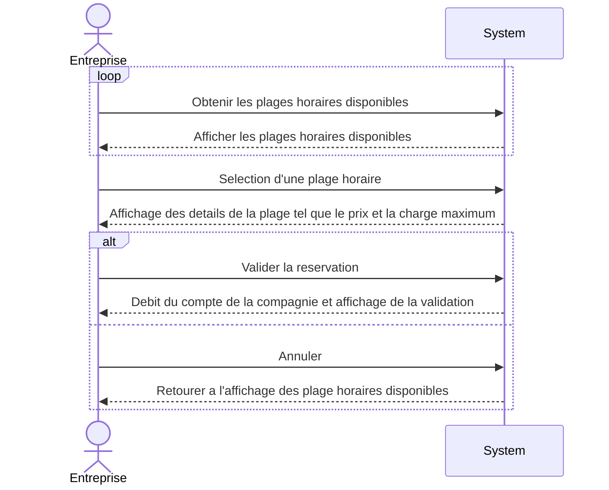
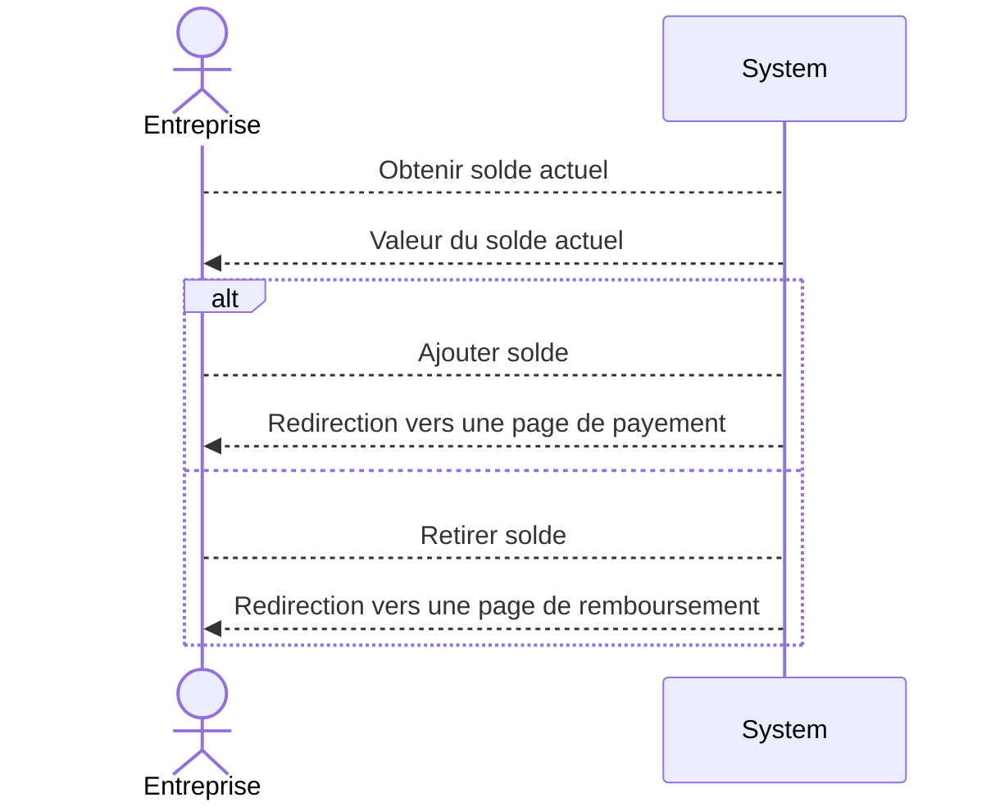

## Réservation d'une plage horaire

```mermaid
sequenceDiagram
    actor Entreprise
    participant System
    loop
        Entreprise ->> System : Obtenir les plages horaires disponibles
        System -->> Entreprise : Afficher les plages horaires disponibles
    end

    Entreprise ->> System : Selection d'une plage horaire
    System -->> Entreprise : Affichage des details de la plage tel que le prix et la charge maximum
    alt
        Entreprise ->> System : Valider la reservation
        System -->> Entreprise : Debit du compte de la compagnie et affichage de la validation
    else
        Entreprise ->> System : Annuler
        System -->> Entreprise : Retourer a l'affichage des plage horaires disponibles
    end

```

## Gestion du solde

```mermaid
sequenceDiagram
    actor Entreprise
    participant System
    
    Entreprise --> System: Obtenir solde actuel
    System -->> Entreprise: Valeur du solde actuel

    alt
        Entreprise --> System : Ajouter solde
        System -->> Entreprise: Redirection vers une page de payement
    else
        Entreprise --> System : Retirer solde
        System -->> Entreprise : Redirection vers une page de remboursement
    end
```
