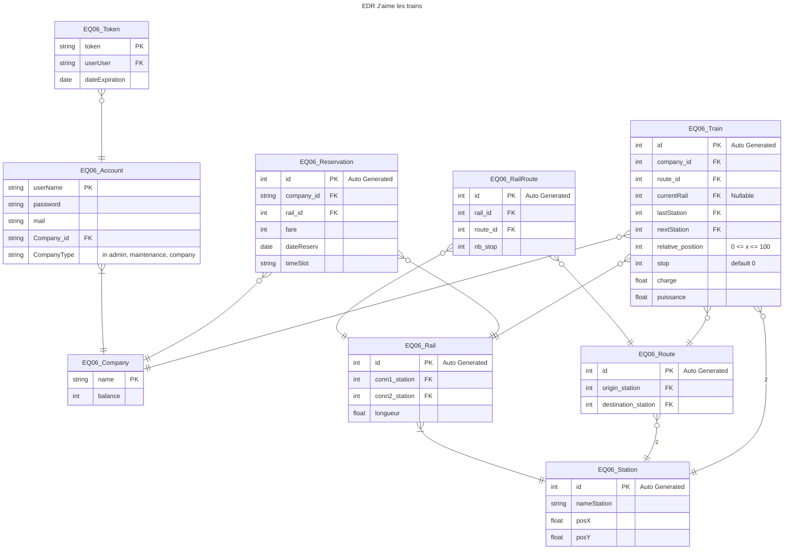

```mermaid
---
title: EDR J'aime les trains
---

erDiagram
    EQ06_Account {
        string userName PK
        string password
        string mail
        string Company_id FK
        string CompanyType "in admin, maintenance, company"
    }
    EQ06_Account }|--|| EQ06_Company : ""
    EQ06_Company {
        string name PK
        int balance
    }
    EQ06_Rail {
    int id PK "Auto Generated"
    int conn1_station FK
    int conn2_station FK
    float longueur
    }
    EQ06_Rail }|--|| EQ06_Station : ""
    EQ06_RailRoute {
        int id PK "Auto Generated"
        int rail_id FK
        int route_id FK
        int nb_stop
    }
    EQ06_RailRoute }o--|| EQ06_Rail : ""
    EQ06_RailRoute }o--|| EQ06_Route : ""
    EQ06_Reservation {
        int id PK "Auto Generated"
        string company_id FK
        int rail_id FK
        int fare
        date dateReserv
        string timeSlot
    }
    EQ06_Reservation }o--|| EQ06_Company : ""
    EQ06_Reservation }o--|| EQ06_Rail : ""
    EQ06_Route {
        int id PK "Auto Generated"
        int origin_station FK
        int destination_station FK
    }
    EQ06_Route }o--|| EQ06_Station : "2"

    EQ06_Station {
        int id PK "Auto Generated"
        string nameStation
        float posX
        float posY
    }
    EQ06_Token {
        string token PK
        string userUser FK
        date dateExpiration
    }
    EQ06_Token }o--|| EQ06_Account : ""
    EQ06_Train {
        int id PK "Auto Generated"
        int company_id FK
        int route_id FK
        int currentRail FK "Nullable"
        int lastStation FK
        int nextStation FK
        int relative_position "0 <= x <= 100"
        int stop "default 0"
        float charge
        float puissance
    }
    EQ06_Train }o--|| EQ06_Company : ""
    EQ06_Train }o--|| EQ06_Rail : ""
    EQ06_Train }o--|| EQ06_Station : "2"
    EQ06_Train }o--|| EQ06_Route : ""


```
