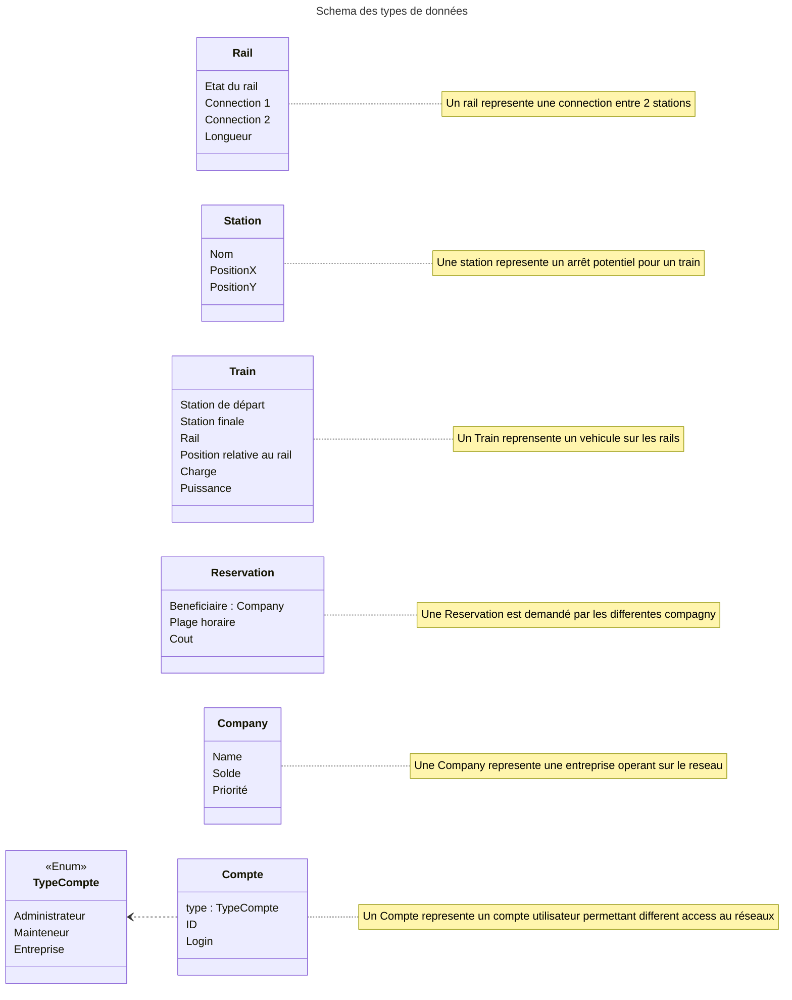

# 
Identification des données utilisée par notre projet.

```mermaid
---
title: Schema des types de données
---
classDiagram
    direction RL
    note for Rail "Un rail represente une connection entre 2 stations"
    class Rail {
        Etat du rail
        Connection 1
        Connection 2
        Longueur
    }
    
    note for Station "Une station represente un arrêt potentiel pour un train"
    class Station {
        Nom
        PositionX
        PositionY
    }

    note for Train "Un Train reprensente un vehicule sur les rails"
    class Train {
        Station de départ
        Station finale
        Rail
        Position relative au rail
        Charge
        Puissance
    }
    note for Reservation "Une Reservation est demandé par les differentes compagny"
    class Reservation {
        Beneficiaire : Company
        Plage horaire
        Cout
    }

    note for Company "Une Company represente une entreprise operant sur le reseau"
    class Company {
        Name
        Solde
        Priorité
    }

    class TypeCompte  {
        <<Enum>>
        Administrateur
        Mainteneur
        Entreprise
    }

    note for Compte "Un Compte represente un compte utilisateur permettant different access au réseaux"
    class Compte {
        type : TypeCompte
        ID
        Login
    }

    Compte ..> TypeCompte
```
