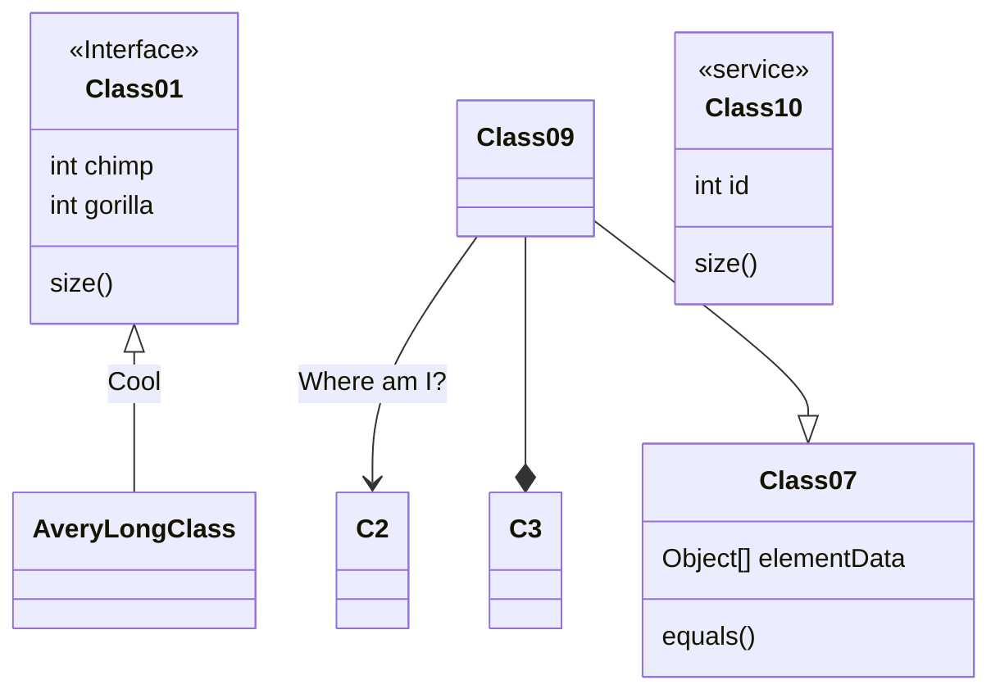

## **Projet Intégrateur: Application de gestion de réseau ferroviaire**

**Contexte du Projet**

- Ce projet consiste à developper une application de gestion d'un reseau ferroviaire. Elle sera destinée au pays, régions et provinces qui autorise la construction des infrastructure. Elle permettra de geré la construction et maintenance du réseaux, l'état d'occupation des rails, la position de chaque vehicule circulant sur les rails, ainsi que les differentes entreprises (transport de marchandise et de passager) qui opere sur le reseau. 
- Le système comprendra un server de gestion des rails. Il aura une _interface de gestion java_ qui permettra d'ajouter/retirer des rails, de prevoir la maintenance, de gerer les evenements imprévue comme vehicules stationnés sur le rail.
- Il comprendra aussi une _interface de gestion web_ dedié au entreprise operatrice, permetant de gerer le traffic des vehicules, de delayer ou detourner les trains, ...
- Dernierement il comprendra _deux applications mobiles android_, une les pour usagers des compagnies de passager permetant de reserver des places et de s'informer sur l'ETA des transit. L'autre application sera reserver au client des entreprise de transport de marchandise qui permettront de prevoir des livraison et connaitre leurs états.
- Afin de permettre à chaque application d'obtenir et de modifier des donnée, le serveur implementera une API REST.
- Afin de gerer les rails, les vehicules, les entreprises, ect, le serveur aura une base de donnée MariaDB

**Objectifs Pédagogiques**

- Intégrer les compétences en développement Web, PHP, Android et en gestion de bases de données relationnelles.
- Concevoir et implémenter une API REST pour la manipulation et l'échange de données.
- Créer des interfaces utilisateur adaptées aux différents rôles au sein d'une équipe de projet.
- Appliquer des concepts avancés de gestion de projet dans un contexte logiciel.

**Description du Projet**

Le système se divise en six composants principaux :

1. **Base de donné relationnelle** :
    - Gestion de la position de chaque vehicles (Vehicule de maintenance, Locomitive, Transport de passager, Transport de marchandise)
    - Gestion de l'état de chaque station
    - Gestion des differents connection entre les stations
    - Gestion des entreprises operant sur le reseaux

2. **API REST**
    - Ajout/suppression de rails
    - Ajout/suppression de stations
    - Ajout/suppression d'entreprise
    - Ajout/suppression de vehicle
    - Ajout/suppression de réservation de d'un rails
    - Ajout/suppression de maintenance
    - ...

3. **Application JAVA d'administration**
    - Authentification de differents compte utilisateur (Administrateur, Maintenance, ect)
    - Vue de l'état du reseaux en temps réels
    - Contrôle total du reseau pour l'administrateur (Suppresion/Ajout de ligne, Delai de trains, ect)

4. **Application WEB d'operateur reseaux**
    - Reservation d'une ligne pour un trajet
    - Gestion du solde de l'entreprise

5. **Application Android pour les utilisateurs des operateurs passagers**
    - Reservation de billets
    - ETA de chaque billets

6. **Application Android pour les utilisateurs des operateurs marchandise**
    - Reservation de wagon de transports pour livrasions
    - ETA du transport

@startuml
interface Mediator
interface Colleague
class ConcreteMediator
ConcreteMediator : mediate()
class ConcreteColleague1
class ConcreteColleague2
ConcreteColleague1 : getState()
ConcreteColleague1 : action1()
ConcreteColleague2 : getState()
ConcreteColleague2 : action2()
Colleague --> Mediator : mediator

ConcreteMediator ..|> Mediator
ConcreteColleague1 ..|> Colleague
ConcreteColleague2 ..|> Colleague
Mediator --> ConcreteColleague1
Mediator --> ConcreteColleague2

class Runway {
    +add(plane:Plane)
    -remove()
    ~maintain()
}
@enduml

``` chart
{
  "type": "pie",
  "data": {
    "labels": [
      "Red",
      "Blue",
      "Yellow"
    ],
    "datasets": [
      {
        "data": [
          300,
          50,
          100
        ],
        "backgroundColor": [
          "#FF6384",
          "#36A2EB",
          "#FFCE56"
        ],
        "hoverBackgroundColor": [
          "#FF6384",
          "#36A2EB",
          "#FFCE56"
        ]
      }
    ]
  },
  "options": {}
}
```


**Exigences Fonctionnelles**

1. **API REST**
    - _Endpoints de rails_ : Creation, Suppression et modification de l'état de chaque rails sur le reseau
    - _Endpoints de stations_ : Creation, Suppression et modification de l'état de chaque station sur le reseau    
    - _Endpoints de vehicule_ : Creation, Suppression et modification de la position, vitesse, charge, puissance, ect de chaque vehicule operrant sur le reseau.
    _ _Endpoints de réservations_ : Creation et Suppression de chaque réservations sur le reseau
    - _Endpoints d'utilisateurs_ : Inscription, authentification, Suppresion d'administrateur, de Mainteneur, ainsi que de compte d'entreprise.
    - _Endpoints de marchandise: Gestion d'entreprise de marchandise, reservation de capacité sur train
    - _Endpoints de passagers: Gestion des billets, reservations de billet, obtention d'ETA de trains.

3. **Application JAVA d'administration**
    - _Interface graphique de l'état du reseaux_: affichage des rails, stations et vehicules.
    - _Interface de modification du reseaux_ : Modification des stations et des rails
    - _Interface de gestion d'entreprise_ : Inscription et modification d'entreprise_

3. **Interface Web** :
    - _

**Critères de Réussite**

- **Fonctionnalité** : Le système doit répondre à toutes les exigences fonctionnelles spécifiées.
- **Utilisabilité** : Interfaces intuitives et adaptées aux besoins des utilisateurs.
- **Fiabilité** : Sécurité des données, gestion des erreurs et stabilité de l'application.
- **Performance** : Réactivité et efficacité dans la gestion des données et des communications.
- **Maintenabilité** : Code bien structuré, documenté et facile à maintenir.

**Livraisons**

1. **Documentation du Projet** :
   - Spécifications détaillées des exigences fonctionnelles.
   - Architecture du système et choix technologiques.
   - Guides d'utilisation pour les différentes interfaces.
   - Rapport de tests et d'assurance qualité.

2. **Code Source** :
   - Code source pour l'application Android, l'interface Web et l'API REST.
   - Instructions pour la configuration et le déploiement.

3. **Présentation Finale** :
   - Démonstration du fonctionnement de l'application.
   - Explication des choix techniques et des défis rencontrés.

**Évaluation**

Le projet sera évalué sur :

- La conformité aux exigences fonctionnelles et techniques.
- La qualité et la propreté du code.
- L'efficacité de l'interface utilisateur.
- La performance et la stabilité de l'application.
- La qualité de la documentation et de la présentation.

**Conclusion**

Ce projet offre une occasion exceptionnelle de développer une application complète qui intègre des compétences variées en développement logiciel et en gestion de projet. Il vous permettra de comprendre comment les différentes technologies et plateformes peuvent être combinées pour créer une solution efficace répondant aux besoins réels des équipes de projet. Nous attendons avec impatience de voir vos solutions innovantes et efficaces!
