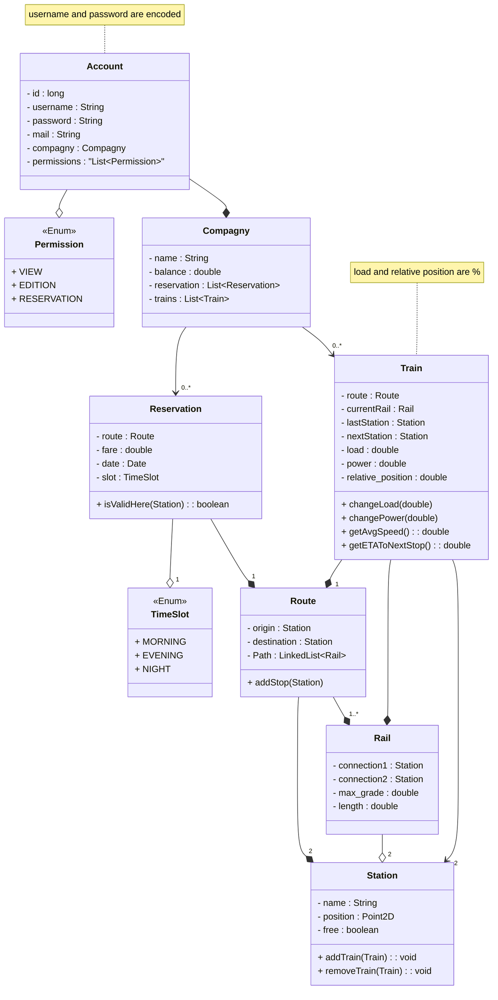

```mermaid
classDiagram
    direction TB
    class Station {
        - name : String
        - position : Point2D
        - free : boolean
        + addTrain(Train) : void
        + removeTrain(Train) : void
    }
    class Route {
        - origin : Station
        - destination : Station
        - Path : LinkedList&ltRail>
        + addStop(Station)
    }
    class Rail {
        - connection1 : Station
        - connection2 : Station
        - max_grade : double
        - length : double
    }
    Route --* "2" Station
    Route --* "1..*" Rail
    Rail --o "2" Station

    class Reservation {
        - route : Route
        - fare : double
        - date : Date
        - slot : TimeSlot
        + isValidHere(Station) : boolean
    }
    class TimeSlot {
        <<Enum>>
        + MORNING
        + EVENING
        + NIGHT
    }
    Reservation --o "1" TimeSlot
    Reservation --* "1" Route

    Train --* "1" Route
    Train --* Rail
    Train --> "2" Station

    note for Train "load and relative position are %"
    class Train {
        - route : Route
        - currentRail : Rail
        - lastStation : Station
        - nextStation : Station
        - load : double
        - power : double
        - relative_position : double
        + changeLoad(double)
        + changePower(double)
        + getAvgSpeed() : double
        + getETAToNextStop() : double
    }


    class Compagny {
        - name : String
        - balance : double
        - reservation : List&ltReservation>
        - trains : List&ltTrain>
    }
    Compagny --> "0..*" Reservation
    Compagny --> "0..*" Train
    note for Account "username and password are encoded"
    class Account {
        - id : long
        - username : String
        - password : String
        - mail : String
        - compagny : Compagny
        - permissions : "List&ltPermission>"
    }
    class Permission {
        <<Enum>>
        + VIEW
        + EDITION
        + RESERVATION
    }

    Account --o Permission
    Account --* Compagny

```
